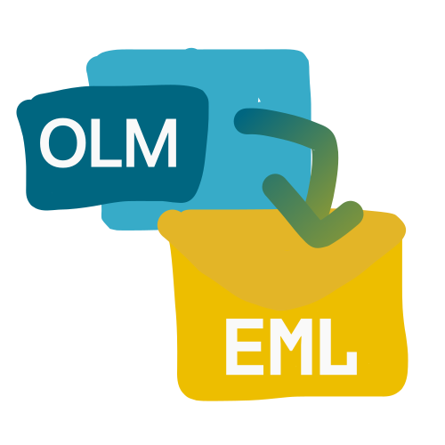
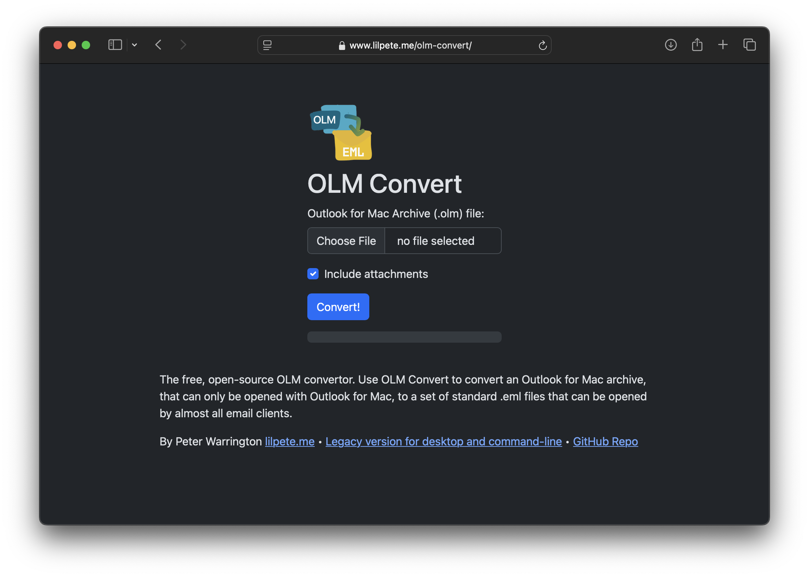
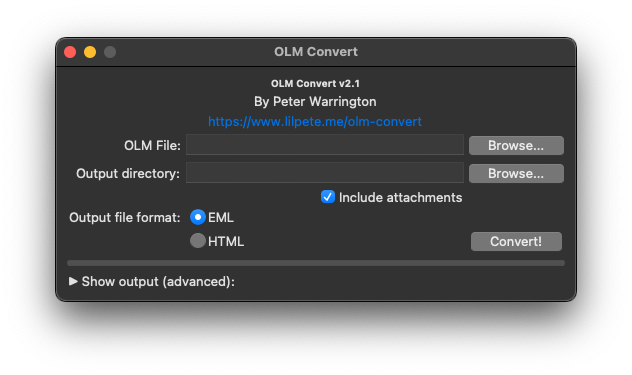

# OLM Convert

The free, open-source, online OLM convertor.



[Use on the web](https://lilpete.me/olm-convert) | [Download the legacy version for desktop and command-line](https://lilpete.me/olm-convert-legacy)

A utility to convert an Outlook for Mac archive (.olm file), that can only be opened with Outlook for Mac, to standard .html or .eml file formats, viewable in your browser.

Output files are organised hierarchically, for example a message contained in an OLM file will be output to a file like `"<output directory>/example@example.com/Inbox/Subject - Mon, 04 July 2022 21.04.56.eml"`.

Available as a web app, Legacy GUI, a python command-line interface, and as a module.

Supports attachments but can only output emails with the HTML and plain text content types.

## Usage

### Web:




### Legacy GUI:



### Legacy Command line:
```
usage: olmConvert.py [-h] [--noAttachments] [--timestamps] [--format {eml,html}] [--verbose] olmPath outputDir

positional arguments:
  olmPath              Path to OLM file
  outputDir            Output directory

options:
  -h, --help           show this help message and exit
  --noAttachments      Don't include attachments in output (decreasing file size)
  --timestamps         Adjust each file's timestamp to corresponding send time
  --format {eml,html}  Specifies output format
  --verbose            Verbose output
```
## Module reference

### convertOLM(olmPath, outputDir, noAttachments=False, verbose=False, format="eml")
Convert OLM file specified by `olmPath`, creating a directory of files of type `format` at `outputDir`. Will not include attachments if optional parameter `noAttachments` is set to True.

`format` must be `eml` or `html`.

### processMessage(xmlString, olmZip=None, noAttachments=False, format="eml")
Reads OLM format XML message (`xmlString`) and returns a ConvertedMessage object containing the message converted to a string of the provided `format`. Can also return ValueError.

`olmZip` parameter is a instance of `zipfile.ZipFile` open on the OLM file. This parameter is required in order to convert attachments.

If `noAttachments` parameter is True, no attachments will be included in generated EML messages.

`format` must be `eml` or `html`.

### headerEncode(value)
Converts email header string value to RFC2047 base64 encoded UTF-8 string (<https://datatracker.ietf.org/doc/html/rfc2047>).

### addressEncode(addressElm)
Converts `<emailAddress>` element ([xml.etree.ElementTree.Element](https://docs.python.org/3/library/xml.etree.elementtree.html#xml.etree.ElementTree.Element)) to an email header value.

### generateBoundaryUUID()
Generates a MIME boundary ID (<https://datatracker.ietf.org/doc/html/rfc2046#section-5.1.1>).

### lineWrapBody(body)
Wraps lines of a given HTML body to maximum of 78 characters as recommended by RFC 2822 (https://datatracker.ietf.org/doc/html/rfc2822#section-2.1.1).

### processAttachment(attachmentElm, olmZip, format="eml")
Generate file data for use with specified `format`.

`attachmentElm` specifies the `<messageAttachment>` OLM element ([xml.etree.ElementTree.Element](https://docs.python.org/3/library/xml.etree.elementtree.html#xml.etree.ElementTree.Element)) containing the attachment.

`olmZip` parameter is a instance of `zipfile.ZipFile` open on the OLM file. Required as attachment files are contained within OLM file.

`format` must be `eml` or `html`.

When using `format=EML`, this does not provide message boundaries.
